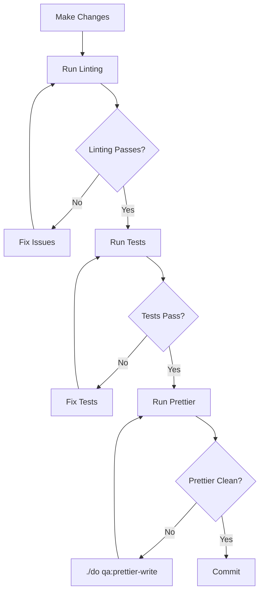

# MailPoet Development Cycle

This skill covers running tests, linting, and building assets for MailPoet development.

## Working Directory

This is a monorepo. All plugin-level `./do` commands MUST be run from the correct subdirectory:

- **Free plugin** (default): `mailpoet/`
- **Premium plugin**: `mailpoet-premium/`
- **Repo root** `./do`: Docker wrapper that forwards commands. Use `./do --test` for test commands, `./do --premium` for premium.

Unless you are explicitly working on the premium plugin, always default to the free plugin directory.

## When to Use This Skill

- Before committing code changes
- When running tests or linting
- When setting up the development environment
- When building frontend assets
- When fixing CI failures related to code quality or tests

## Skill Contents

| Document                                           | Purpose                                                                   |
| -------------------------------------------------- | ------------------------------------------------------------------------- |
| [code-quality.md](code-quality.md)                 | JS/TS linting (ESLint), CSS/SCSS linting (Stylelint), Prettier formatting |
| [php-coding-standards.md](php-coding-standards.md) | PHP lint, PHPCS, PHPStan static analysis                                  |
| [running-tests.md](running-tests.md)               | Unit, integration, acceptance, JS tests and Docker workflow               |

## Quick Reference

All commands below default to the free plugin. Run from the repo root.

```bash
# QA (all checks: PHP lint + PHPCS + ESLint + Stylelint)
cd mailpoet && ./do qa

# PHP only (lint + PHPCS)
cd mailpoet && ./do qa:php

# PHPStan static analysis
cd mailpoet && ./do qa:phpstan

# JS/TS linting (ESLint + TypeScript check)
cd mailpoet && ./do qa:lint-javascript

# CSS/SCSS linting (Stylelint)
cd mailpoet && ./do qa:lint-css

# Prettier check / fix
cd mailpoet && ./do qa:prettier-check
cd mailpoet && ./do qa:prettier-write

# Fix a single file (PHPCS or ESLint based on extension)
cd mailpoet && ./do qa:fix-file path/to/file.php
cd mailpoet && ./do qa:fix-file path/to/file.tsx

# Unit tests (from repo root, uses isolated test DB)
./do --test test:unit --file=tests/unit/Path/To/SomeTest.php

# Integration tests (from repo root, uses isolated test DB)
./do --test test:integration --skip-deps --file=tests/integration/Path/To/SomeTest.php

# Acceptance tests (from repo root, uses isolated test DB)
./do --test test:acceptance --skip-deps --file=tests/acceptance/Path/To/SomeCest.php

# JavaScript tests (no DB, run from mailpoet/)
cd mailpoet && ./do test:javascript
```

## Development Workflow



## Pre-Commit Checklist

Before committing, run these from the repo root:

- [ ] `cd mailpoet && ./do qa` -- all PHP and frontend QA checks pass
- [ ] `cd mailpoet && ./do qa:prettier-write` -- formatting is clean
- [ ] `./do --test test:unit` -- unit tests pass (if PHP changed)
- [ ] `./do --test test:integration --skip-deps` -- integration tests pass (if backend changed)
- [ ] `cd mailpoet && ./do test:javascript` -- JS tests pass (if JS/TS changed)

## Premium Plugin

When working on `mailpoet-premium/`, substitute the directory:

```bash
cd mailpoet-premium && ./do qa
cd mailpoet-premium && ./do qa:phpstan
```

Or use the root wrapper:

```bash
./do --premium qa
```
